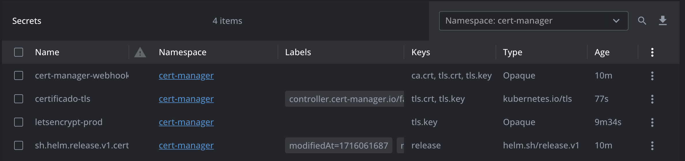

# Documentation: Cert-manager

## What is Cert-manager?

Cert-manager is a Kubernetes-native solution for automating the issuance and renewal of TLS/SSL certificates. It integrates with various Certificate Authorities (CAs), including Let's Encrypt, to provide an automated way to ensure that your certificates are always up to date.

## Installing Cert-manager with Helm

Installing cert-manager using Helm is a simple and recommended process for efficiently managing cert-manager in Kubernetes. Follow the steps below to install:

1. Add the cert-manager Helm repository:

   ```bash
   helm repo add jetstack https://charts.jetstack.io
   ```

2. Update the Helm repository list to ensure you have the latest versions available:

   ```bash
   helm repo update
   ```

3. Install cert-manager in your Kubernetes cluster with the desired version, creating the `cert-manager` namespace and configuring the necessary Custom Resource Definitions (CRDs):

   ```bash
   helm upgrade --install \
     cert-manager jetstack/cert-manager \
     --namespace cert-manager \
     --create-namespace \
     --versionv1.14.5 \
     -f custom-values.yaml
   ```

   The custom-values.yaml file from that repository already includes integration with AWS Route 53. However, to enable this integration, you need to follow the steps outlined in the `aws-route53-integration` folder. If you’re not planning to use Route 53, you can omit the `serviceAccount` and `securityContext` variables from the custom values.

After running these commands, cert-manager will be installed and ready for use in your Kubernetes cluster.

You can use the `install-cert-manager.py` script to perform the previous steps.

## Additional Configuration

After installation, you can configure `ClusterIssuers` or `Issuers` to issue certificates, depending on your needs and cluster configuration.

In this updated version of the documentation, the steps to install `cert-manager` via Helm are detailed, including adding the repository, updating repositories, and the command to install or upgrade `cert-manager`.

To see the latest available version, refer to "https://cert-manager.io/docs/installation/"

## Explained Configuration Files

### ClusterIssuer

The `ClusterIssuer` file is used to define an entity that can issue certificates. Here's a brief explanation of the fields in this file:

#### Let's Encrypt with Route 53 (DNS-01 Challenge)

```yaml
apiVersion: cert-manager.io/v1
kind: ClusterIssuer
metadata:
  name: letsencrypt-prod
spec:
  acme:
    server: https://acme-v02.api.letsencrypt.org/directory # ACME server address
    email: guilherme_f.reis@hotmail.com # Email to register and retrieve lost credentials
    privateKeySecretRef:
      name: letsencrypt-prod # Secret that will store the ACME account key
    solvers:
    - selector: # R53 Solver
        dnsZones:
          - "guilhermefreis.com"
      dns01:
        route53:
          region: us-east-1
          hostedZoneID: Z06942553H9NBQ4TIUM5T
```

#### Let's Encrypt with NGINX (HTTP-01 Challenge)

```yaml
apiVersion: cert-manager.io/v1
kind: ClusterIssuer
metadata:
  name: letsencrypt-nginx
spec:
  acme:
    server: https://acme-v02.api.letsencrypt.org/directory # ACME server address
    email: guilherme_f.reis@hotmail.com # Email to register and retrieve lost credentials
    privateKeySecretRef:
      name: letsencrypt-nginx # Secret that will store the ACME account key
    solvers:
    - http01:
        ingress:
          class: nginx # Use the NGINX ingress controller to solve the HTTP-01 challenge
```

### Certificate

The `Certificate` file is used to request a certificate from an `Issuer` or `ClusterIssuer`. It defines which domains you want a certificate for, among other details:

```yaml
apiVersion: cert-manager.io/v1
kind: Certificate
metadata:
  name: my-certificate
  namespace: cert-manager
spec:
  secretName: my-certificate-tls # Secret name where the certificate will be stored
  secretTemplate:
    annotations:
      kubed.appscode.com/sync: "" # Annotation to synchronize the Secret with Kubed
  issuerRef:
    name: letsencrypt-prod # Reference to the previously defined ClusterIssuer
    kind: ClusterIssuer
  dnsNames:
  - "guilhermefreis.com" # Domain for which the certificate will be issued
```

You can find the yamls above in the `resources` directory

### Additional Notes on ClusterIssuer

When using Let's Encrypt with Route 53 (DNS-01 Challenge), ensure that you have configured your AWS account and cluster appropriately. The Route 53 solver requires access to your AWS Route 53 hosted zone. You need to set up appropriate IAM permissions and ensure that the cluster has access to the Route 53 API.

Using Let's Encrypt with NGINX (HTTP-01 Challenge) does not require additional AWS configuration but relies on NGINX ingress controller for solving the HTTP-01 challenge. Ensure that your NGINX ingress controller is correctly configured and reachable from the ACME server for validation.

## Troubleshoting

You can use the follow command to troubleshoot the issuance and renewal of TLS/SSL certificates.

`kubectl get Issuers,ClusterIssuers,Certificates,CertificateRequests,Orders,Challenges -n cert-manager`

The process to approve a certificate can take up to more than 10 minutes.



